  

## 📌 About Me
- 👋 Hi, I’m Shlok
- 💻 Android & Web Developer (Kotlin, Flutter, Next.js)
- 🧠 Love learning by building real-world projects
- 🌐 Exploring full-stack development and UI/UX design

## 📊 GitHub Stats & Trophies

  
  

  

  

  

## 🛠️ Languages & Tools

<h3 align="center">Programming Languages</h3>

  &nbsp;&nbsp;&nbsp;
  &nbsp;&nbsp;&nbsp;
  &nbsp;&nbsp;&nbsp;
  

<h3 align="center">Frontend</h3>

  &nbsp;&nbsp;&nbsp;
  

<h3 align="center">Backend</h3>

  

<h3 align="center">Database</h3>

  &nbsp;&nbsp;&nbsp;
  

<h3 align="center">Tools</h3>

  &nbsp;&nbsp;&nbsp;
  

  

## 🔗 Connect with Me

  &nbsp;&nbsp;&nbsp;&nbsp;&nbsp;
  &nbsp;&nbsp;&nbsp;&nbsp;&nbsp;
  

  

